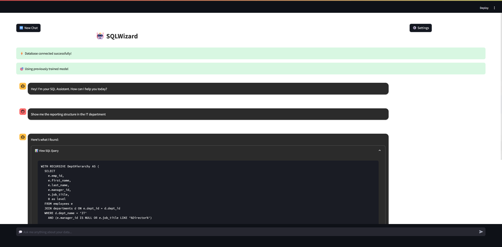

# SQLWizard - Natural Language SQL Assistant 🤖

A modern, AI-powered SQL query assistant that converts natural language questions into SQL queries. Built with Streamlit and Vanna.AI, it provides an intuitive chat interface for database interactions.



## Features ✨

- Natural language to SQL conversion
- Interactive chat interface
- Real-time query execution
- Query result visualization
- CSV export functionality
- Persistent model training
- Schema verification
- Dark mode support

## Tech Stack 🛠️

- **Frontend**: Streamlit
- **Backend**: Python
- **Database**: MySQL
- **AI Model**: Vanna.AI
- **ORM**: SQLAlchemy
- **Data Processing**: Pandas

## Prerequisites 📋

- Python 3.8+
- MySQL Server
- Vanna.AI API Key

## Installation 🚀

1. Clone the repository:
```bash
git clone <repository-url>
cd SQLWizard
```

2. Install dependencies:
```bash
pip install -r requirements.txt
```

3. Configure database:
- Create a MySQL database named `company_v2`
- Update the database configuration in `sql_assistant.py`:
```python
DB_CONFIG = {
    "host": "localhost",
    "user": "root",
    "password": "your_password",
    "dbname": "company_v2",
    "port": 3306
}
```

4. Set up your Vanna.AI API key:
- Get your API key from [Vanna.AI](https://vanna.ai)
- Update the API key in `sql_assistant.py`:
```python
VANNA_API_KEY = "your_api_key"
```

## Usage 💡

1. Start the application:
```bash
streamlit run sql_assistant.py
```

2. Access the web interface at `http://localhost:8501`

3. Start asking questions in natural language:
- "Show me all employees in the IT department"
- "What is the average salary by department?"
- "List all projects with their managers"

## Features in Detail 🔍

### Natural Language Processing
- Converts plain English questions to SQL queries
- Handles complex queries and joins
- Learns from usage patterns

### Interactive Interface
- Chat-like conversation flow
- Real-time query generation
- Expandable SQL query view
- Interactive results display

### Data Management
- Automatic schema verification
- Query result pagination
- CSV export functionality
- Error handling and feedback

### Model Training
- Persistent training state
- Incremental learning
- Schema-aware training
- Example-based training

## Project Structure 📁

```
SQLWizard/
├── sql_assistant.py     # Main application file
├── static/
│   └── styles.css      # CSS styling
├── training_examples.yaml   # Training data
├── model_state.json    # Model state tracking
└── README.md          # Documentation
```

## Contributing 🤝

Contributions are welcome! Please feel free to submit a Pull Request.

## License 📄

This project is licensed under the MIT License - see the LICENSE file for details.

## Acknowledgments 🙏

- [Vanna.AI](https://vanna.ai) for the natural language processing
- [Streamlit](https://streamlit.io) for the web interface
- All contributors and users of this project
